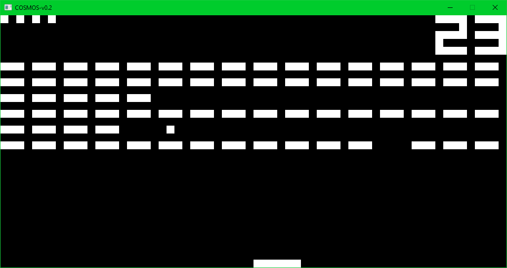
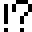

# **COSMOS** _Docs_

## Virtual Machine
### Display

CHIP-8 has a monochrome 64x32 pixels display. Sprites are used to draw everything on the screen, and they are 8 pixels wide and its height is variable, up to 15 pixels.
When the pixel is flipped from set to unset the register VF acts as a Carry Flag and its value is set to 1, otherwise is set to 0.

The original CHIP-8 had a monochrome 64x32 display, other interpreters also had 64x48 or 64x64 modes. Only a few interpreters supported this two extra modes, like the one in the ETI 660.


_Screenshot of the interpreter running on Windows 10 Build: 15063_

### Sprites

Due to the limitations of the CHIP-8, sprites are the only way to render to the screen.
Sprites has a binary representation of what will be seen on the screen.

To see a real example we are going to create a sprite. For this example the sprite will be a exclamation and a question mark. Like this one  .

_For better understanding I have represented the active pixels (aka 1's) in black._

Now we have to translate to binary this sprite, it is very easy due to the simplicity of a monochrome screen. Then, we convert binary to hexadecimal to be able to store the sprite in memory. _A example of what the rendering code does :_

> 00001110  -> 0x0E : 

> 01010001  -> 0x51 : 

> 01010001  -> 0x51 : 

> 01000010  -> 0x42 : 

> 01000100  -> 0x44 : 

> 01000100  -> 0x44 : 

> 00000000  -> 0x00 : 

> 01000100  -> 0x44 : 

#### _DXYN Opcode_

``` cpp
case 0xD000:
{
  uint16_t op_X = V[X(opcode)];
  uint16_t op_Y = V[Y(opcode)];
  uint16_t op_N = N(opcode);
  uint16_t sprite;

  for (int line = 0; line < op_N; line++)
  {
    sprite = ram[I + line];
    for (int offset = 0; offset < 8; offset++)
    {
      if ((sprite & (0x80 >> offset)) != 0) // 0x80 is 0 LSH 8
      {
        if (screen[(op_X + offset + ((op_Y + line) * 64))])	{
          V[0xF] =  1;
        }
        screen[op_X + offset + ((op_Y + line) * 64)] ^= 0x00FFFFFF;

        //In this particular interpreter uint32_t screen[] is a SDL texture buffer.
        //That practise prevents the execution of a 2048 iteration loop
        //needed to copy uint8 data, (like other interpreters do), into a
        //compatible uint32_t SDL texture data.

      }
    }
  }
```
